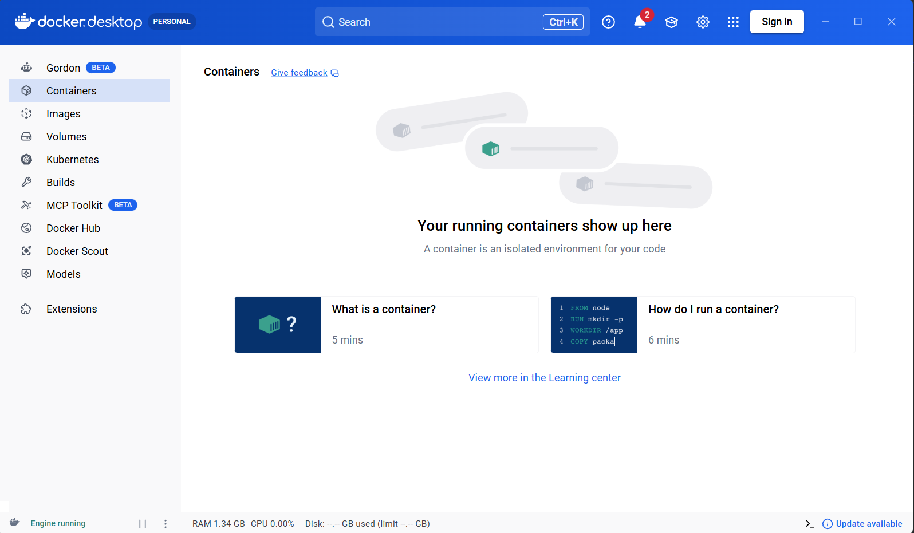
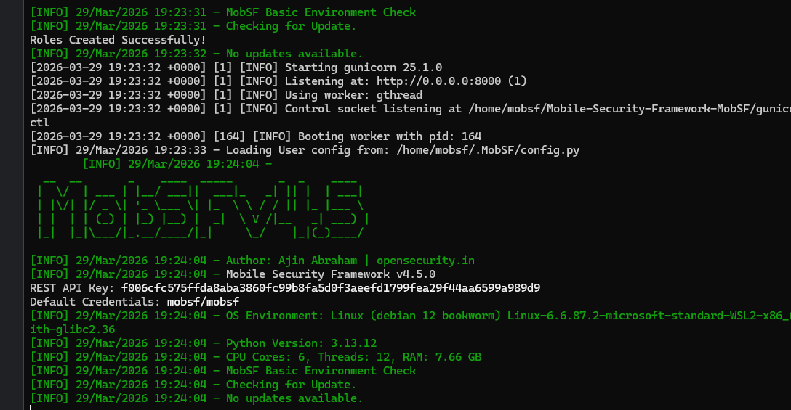
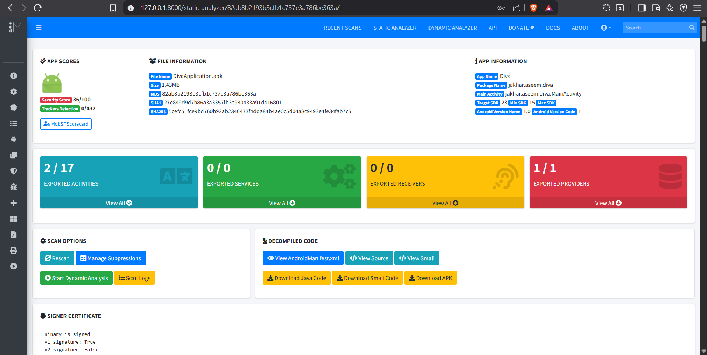
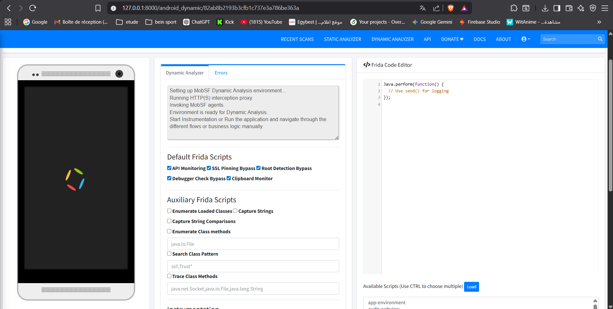
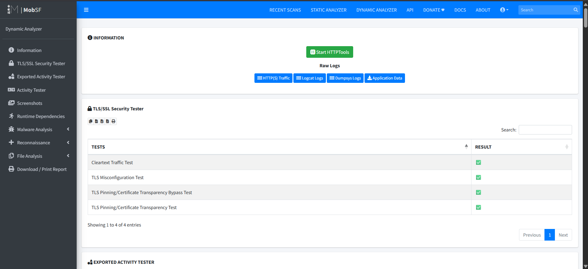
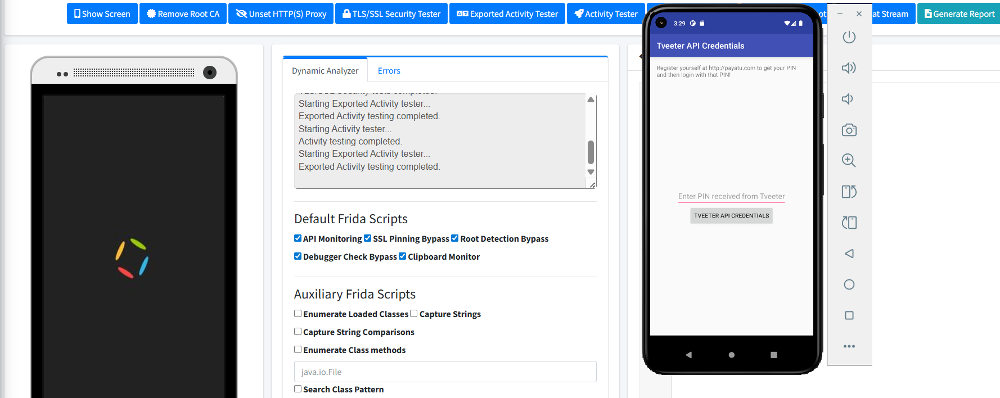
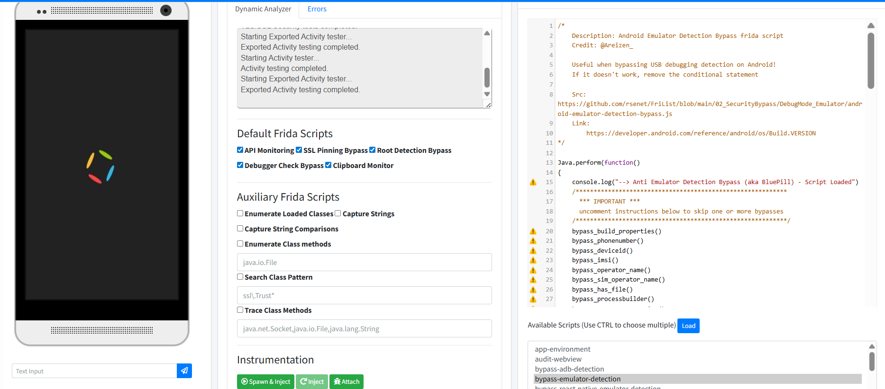

# MobSF avec Docker Desktop et Android Emulator 

## 📌 Présentation

Ce document présente la mise en place de **MobSF (Mobile Security Framework)** sur **Windows** avec **Docker Desktop** et un **émulateur Android**, puis son utilisation pour réaliser une **analyse statique** et une **analyse dynamique** de l'application **DIVA (Damn Insecure and Vulnerable App)**.

L'objectif est de montrer un workflow simple pour :

* préparer l'environnement et lancer MobSF (Docker)
* connecter un émulateur Android
* analyser une APK en statique et dynamique
* utiliser les tests TLS/SSL et les outils Frida intégrés
* consulter logs et résultats

---

## 🛠️ Prérequis

Avant de commencer, il faut disposer de :

* **Docker Desktop** installé et démarré
* **Android Studio** avec au moins un **AVD**
* **Git**
* l'application **DIVA** (ou autre APK)

---

## 1. Préparation de l'environnement (Docker & Émulateur)

Avant de lancer l'analyse, assurez-vous que **Docker Desktop** fonctionne correctement et qu'un **Android Virtual Device (AVD)** est démarré via le Device Manager d'Android Studio. L'émulateur est indispensable pour l'analyse dynamique.



**Figure 1 :** Docker Desktop en cours d'exécution.


**Figure 2 :** Émulateurs Android disponibles.

---

## 2. Installation et Lancement de MobSF

Clonez le dépôt officiel de MobSF, puis lancez-le via Docker en connectant l'émulateur Android :

```bash
git clone https://github.com/MobSF/Mobile-Security-Framework-MobSF.git
cd Mobile-Security-Framework-MobSF
```


**Figure 3 :** Clonage du dépôt.

Lancez le conteneur en spécifiant l'identifiant de votre émulateur :

```powershell
docker run -it `
  -p 8000:8000 -p 1337:1337 `
  -v mobsf_data:/home/mobsf/.MobSF `
  -e MOBSF_ANALYZER_IDENTIFIER=emulator-5554 `
  opensecurity/mobile-security-framework-mobsf:latest
```

MobSF télécharge l'image, initialise l'environnement et démarre son serveur web sur le port **8000**.


**Figure 4 :** Téléchargement de l'image.



**Figure 5 :** Logs de démarrage (serveur sur le port 8000).

---

## 3. Analyse Statique

Accédez à `http://127.0.0.1:8000`, et importez votre APK (ex: **DivaApplication.apk**). MobSF génère un rapport de sécurité contenant le score, les activités/services exportés, le code décompilé (Java/Smali) et le manifeste.



**Figure 6 :** Résultat de l'analyse statique.

---

## 4. Analyse Dynamique et Tests

Cliquez sur **Start Dynamic Analysis** pour préparer l'instrumentation. MobSF met en place un proxy, Frida, et des scripts d'observation. Pendant l'analyse, vous pouvez interagir avec l'application sur l'émulateur, consulter les **logs Logcat**, et lancer des **tests TLS/SSL**.



**Figure 7 :** Interface de l'analyse dynamique.


**Figure 8 :** Consultation des logs Logcat.

Les tests TLS/SSL évaluent la configuration réseau (misconfiguration, pinning, trafic en clair).


**Figure 9 :** Exécution des tests SSL.



**Figure 10 :** Résultats du module TLS/SSL.

L'interaction manuelle avec l'émulateur permet de déclencher des vulnérabilités (Credentials, Input Validation...).



**Figure 11 :** Découverte de credentials API.


**Figure 12 :** Problèmes de validation d'entrée.

---

## 5. Instrumentation Avancée avec Frida

MobSF inclut des **scripts Frida auxiliaires** (ex: bypass de détection d'émulateur) qui peuvent être injectés dynamiquement dans des activités ciblées via **Spawn**, **Inject**, ou **Attach**.



**Figure 13 :** Chargement d'un script de bypass.


**Figure 14 :** Instrumentation via sélection d'activité.

Vous pouvez également visualiser le code du script injecté pour le débogage.


**Figure 15 :** Script Frida injecté.

---

## 6. Outils Complémentaires

L'interface dynamique de MobSF propose d'autres onglets d'analyse : observation du trafic HTTP(S), Dumpsys, accès aux données internes et un shell Android direct.


**Figure 16 :** Vue des outils dynamiques de MobSF.

---

## 🚀 Commandes Rapides

```bash
# Cloner MobSF
git clone https://github.com/MobSF/Mobile-Security-Framework-MobSF.git
cd Mobile-Security-Framework-MobSF

# Lancer MobSF via Docker
docker run -it -p 8000:8000 -p 1337:1337 -v mobsf_data:/home/mobsf/.MobSF -e MOBSF_ANALYZER_IDENTIFIER=emulator-5554 opensecurity/mobile-security-framework-mobsf:latest

# Accès Web
http://127.0.0.1:8000
```
